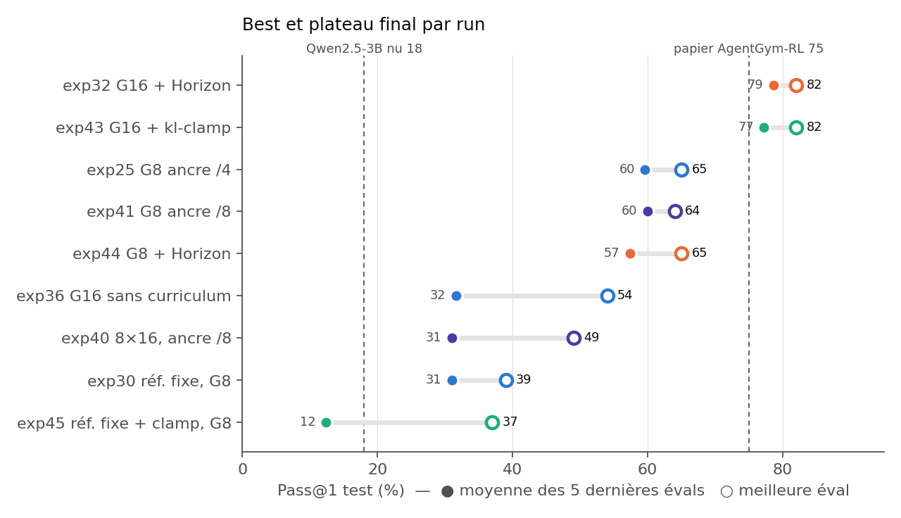
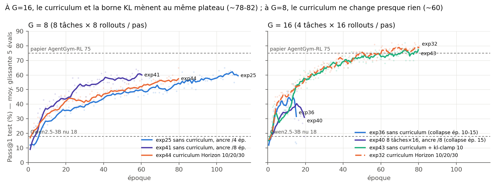
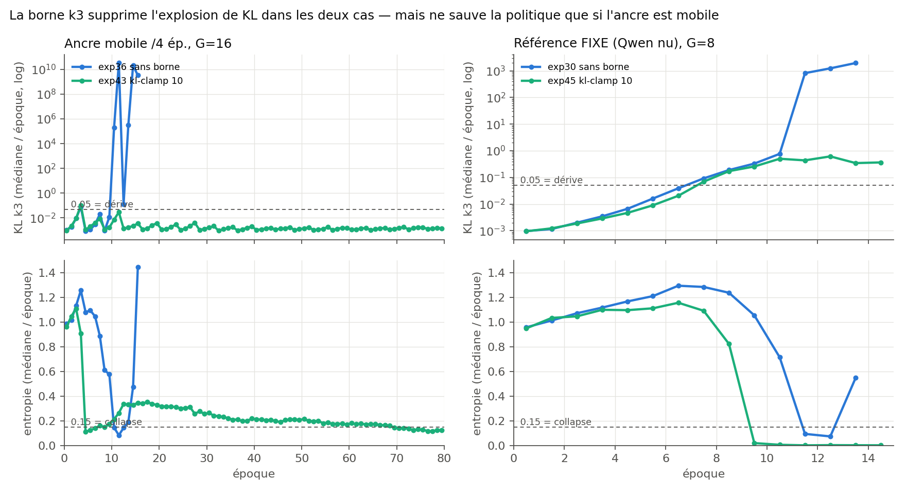
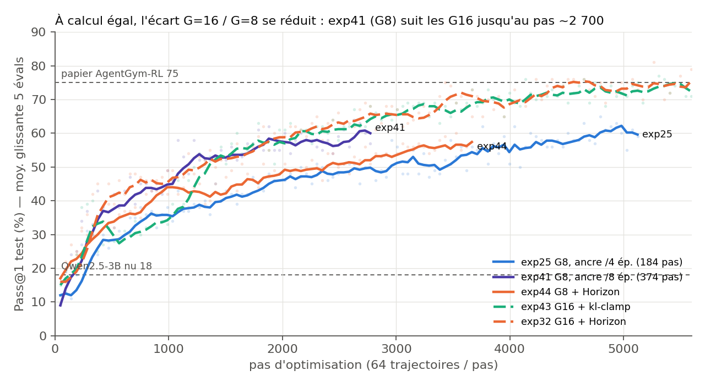
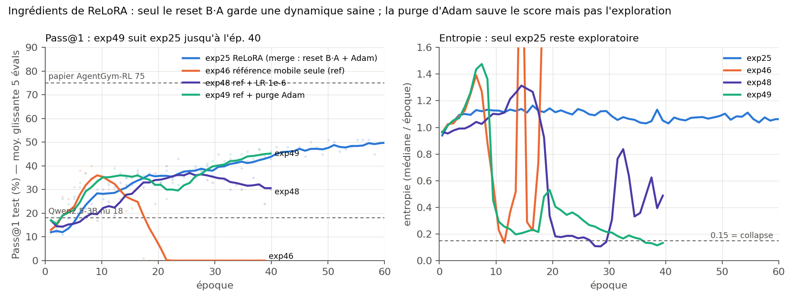
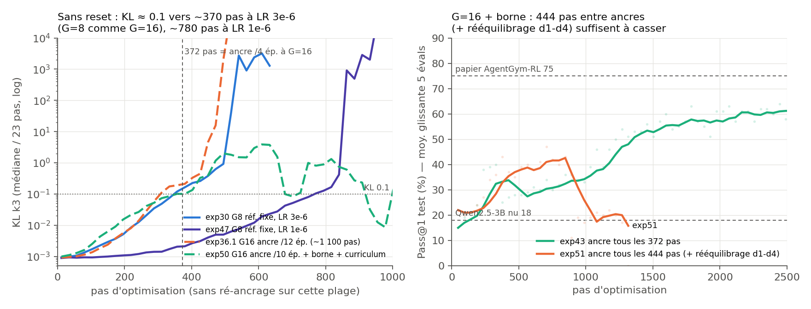

# Analyse rapide — runs post-rapport (exp41 → exp51), 24/09 → 02/10/2026

Runs couverts : **exp43** (G=16 + kl-clamp, fin 23/09), **exp45** (référence fixe + kl-clamp, 23/09),
**exp44** (curriculum Horizon à G=8, fin 24/09 14:03), **exp41** (G=8, ancre /8 ép., rappel),
**exp46** → **exp51.1** (ablation de ReLoRA et rythme d'ancre, §5-§7). Références : exp25, exp30, exp32, exp36, exp40.

Reproduire : `python docs/post_rapport/extract_runs.py` (logs → `runs_data.json`, env v2) puis
`python3 docs/post_rapport/plot_runs.py` (matplotlib, python système).
Une éval porte sur 100 items (bruit ≈ ±5 pts) : on lit les **moyennes glissantes sur 5 évals** et le
« plateau » (moyenne des 5 dernières évals), pas les pics isolés.

## Tableau de synthèse

| Run | Delta clé | Best | Plateau (5 dern.) | Statut |
|---|---|---|---|---|
| exp32 | G16 + Horizon 10/20/30 (réf.) | 82 | 79 | terminé (80 ép.) |
| **exp43** | G16 **sans curriculum** + `--kl-clamp 10` | **82** | **77** | terminé 23/09 (80 ép., reprise ckpt-5358) |
| exp25 | G8, ancre /4 ép. (réf.) | 65 | 60 | ép. 111 (purge) |
| exp41 | G8, ancre /8 ép. | 64 | 60 | mort ép. ~59 le 11/09 |
| **exp44** | G8 + Horizon 10/20/30 | 65 | 57 | terminé 24/09 (80 ép.) |
| exp36 / exp40 | G16 sans curriculum, sans borne | 54 / 49 | 32 / 31 | collapse ép. 10-15 |
| exp30 | réf. fixe, G8 | 39 | 31 | collapse ép. 11 |
| **exp45** | réf. fixe + `--kl-clamp 10` | 37 | **12** | collapse ép. 9, reward → 0 à l'ép. 13 |
| exp46 | G8, ancre mobile mode `ref` | 40 | 0 | collapse ép. ~9 (§5) |
| exp47 | G8, réf. fixe, LR 1e-6 | 40 | 33 | collapse ép. ~17 (§6) |
| exp48 | G8, `ref` + LR 1e-6 | 40 | 31 | collapse ép. ~18 (§5) |
| exp49 | G8, `ref` + purge Adam | 47 | 45 | entropie/KL cassées, score préservé (§5) |
| exp50 | G16 + Horizon + borne, ancre /10 ép. | 37 | 0 | collapse ép. 5, tué 01/10 (§6) |
| exp51 | G16 + borne + rééquilibrage d1-d4, ancre 444 pas | 47 | ~16 | collapse ép. 8, tué 02/10 (§6) |
| exp51.1 | idem exp51, ancre 372 pas | 50 | 47 | pas de collapse, arrêté ép. ~16 (voir `BILAN_FINAL.md`) |

## 1. exp43 : la borne KL remplace le curriculum comme stabilisateur à G=16

- exp43 est exp36 à l'identique, avec **un seul changement** : `--kl-clamp 10`. exp36 s'effondrait
  à l'ép. 10 ; exp43 survit 80 ép. et suit la courbe d'exp32 (curriculum) au point près :
  plateau 77 contre 79, best 82 pour les deux.
- La prédiction écrite le 15/09 pour le cas « tient » est donc vérifiée : **la KL non bornée
  était la cause de la divergence**, pas seulement un symptôme.
- Cela nuance la conclusion du rapport (« le curriculum agit en régulariseur d'exploration ») :
  à G=16, **curriculum et borne k3 sont deux protections interchangeables** contre le même mode
  de défaillance. La performance elle-même vient d'ailleurs (voir §3).
- À surveiller : l'entropie d'exp43 tombe à **0.11-0.15 dès l'ép. 4-8** (fig. 2), au même niveau
  que le collapse d'exp36, puis **remonte à ~0.33** et redescend lentement jusqu'à 0.13 à l'ép. 80.
  La borne n'empêche pas la chute d'entropie ; elle empêche qu'une chute d'entropie entraîne
  une KL qui explose (runaway).

## 2. exp45 : la borne ne remplace PAS l'ancre mobile

- exp45 = exp30 (référence KL fixe = Qwen nu) + `--kl-clamp 10`. La KL médiane reste bornée
  (~0.3-0.6, contre 10³ pour exp30), mais elle **dérive exactement comme exp30 jusqu'à l'ép. 9**
  (même pente géométrique, 0.05 franchi vers l'ép. 7).
- L'entropie s'effondre **plus tôt et plus complètement** que sans borne : 0.02 à l'ép. 9, puis
  0.00. Le reward train tombe à 0 aux ép. 13-14, avec un Pass@1 test à 0/100 au pas 658.
- La prédiction du 22/09 est confirmée : au-delà du ratio où la borne s'applique, le gradient KL
  est nul, donc sans rappel la politique dérive comme si β=0. La borne ne traite que la queue de
  l'estimateur ; **l'ancre mobile reste nécessaire**. Le carré ancre × borne est complet :
  mobile+borne = 82, mobile seule = 73, fixe+borne = collapse, fixe seule = collapse.

## 3. exp44 : à G=8, le curriculum Horizon n'apporte presque rien

- exp44 = exp25 + curriculum Horizon (le run manquant de la phase 2). Plateau 57 contre 60 pour
  exp25 à époque comparable ; les deux montent de la même façon (fig. 1 gauche). Le 65 d'exp44
  est la dernière éval (pic isolé : 56, 65, puis fin).
- exp44 est un peu plus rapide au début (≥ 50 % dès l'ép. 52 contre 64 pour exp25), mais sans
  changement de régime.
- Lecture de la matrice G × curriculum : **le curriculum n'est pas ce qui donne 82**. À G=8,
  il ne change presque rien ; à G=16, la borne k3 le remplace. Le curriculum sert de protection
  contre le collapse de G=16, pas de moteur de performance.

## 4. Attention à l'abscisse « époque » : à calcul égal, l'écart G16 / G8 se réduit

- Tous ces runs font 64 trajectoires par pas, mais une époque G=16 dure **93 pas** contre 46 à
  G=8 (chaque tâche est jouée 16 fois). À époque égale, G=16 a donc reçu **2× plus de calcul**.
- En pas (même nombre de trajectoires), au pas 2 700 : exp32 64, exp43 62, **exp41 61**, exp44 51,
  exp25 49. Au pas 3 600 : exp32 72, exp43 66, exp44 57, exp25 53.
- Signal nouveau : **exp41 (G8, ancre toutes les 374 pas) suit les runs G16 jusqu'au pas ~2 700**,
  alors qu'exp25 (G8, ancre toutes les 184 pas) est ~10 pts en dessous. Or 374 pas est aussi le
  rythme d'ancre en pas d'exp32/exp43. **Hypothèse (non établie)** : une partie de l'avantage
  attribué à G=16 viendrait du rythme de ré-ancrage exprimé en pas. Ce que les données ne disent
  pas encore : exp41 est mort avant de montrer son plateau (au-delà de 60 ?).

## 5. Suite (25/09 → 02/10) : qu'est-ce qui stabilise ReLoRA ?

ReLoRA (mode `merge`, toutes les recettes stables) fait trois choses à chaque ré-ancrage : (a) déplacer
la référence KL vers la politique courante, (b) remettre le produit B·A à zéro (fusion dans la base,
B = 0, A retiré au hasard), (c) purger Adam. Les runs exp46 → exp49 les séparent (G=8, recette exp25).

| Run | Ingrédients gardés | Résultat |
|---|---|---|
| exp25 | (a) + (b) + (c) | stable, entropie ~1.1 jusqu'à l'ép. 60, 65 @ ép. 104 |
| exp46 | (a) seul | collapse ép. ~9 (KL géométrique dans chaque fenêtre), 0/100 dès l'ép. 21 |
| exp48 | (a), LR ÷3 | même collapse, retardé (ép. ~18), plafond ~35 |
| exp49 | (a) + (c) | **ambigu** : KL et entropie cassent dès l'ép. 8 (entropie 0.13-0.3, KL 1 à 10⁴), mais le Pass@1 survit et suit exp25 (45 @ ép. 40), avec des réponses très courtes (~110 tokens contre ~900) |

- Le **reset de B·A (b)** est le seul ingrédient qui garde une dynamique saine (entropie haute, KL ~1e-3).
- La **purge d'Adam (c)** évite la destruction des générations mais pas la déterminisation : exp49
  converge vers une politique quasi déterministe et laconique qui reste performante à 40 ép. On ne
  sait pas si elle aurait continué à progresser comme exp25 (65 au-delà de l'ép. 100).
- Un **LR plus faible** ne fait que retarder la dérive (voir §6) : elle reste géométrique.

## 6. La dérive suit une horloge en pas : ré-ancrer avant ~370 pas

- Sans reset, la KL médiane passe de 1e-3 à ~0.1 en **~370 pas à LR 3e-6, que G vaille 8 (exp30) ou 16
  (exp36.1, exp50)**, puis explose (10³-10⁷) en ~100 pas. À LR 1e-6 (exp47), le même seuil arrive
  vers ~780 pas. Le curriculum et la borne ne ralentissent pas cette dérive initiale (exp50, dans la
  même pente que exp36.1) ; la borne plafonne seulement l'explosion qui suit.
- Conséquence : le ré-ancrage doit tomber **avant ~370 pas**. La période étant définie en ÉPOQUES,
  elle change de valeur en pas avec G et la taille du dataset :

| Run | Pas entre ancres | Verdict |
|---|---|---|
| exp25 (G8, /4 ép.) | 184 | stable, marge ×2 |
| exp41 (G8, /8 ép.) | 374 | stable (limite) |
| exp32 / exp43 (G16, /4 ép.) | 372 | stable (limite, avec curriculum ou borne) |
| exp51 (G16, 444 tâches, /4 ép.) | 444 | collapse ép. 8 |
| exp50 (G16, /10 ép.) | 930 | collapse ép. 5, avant la 1re ancre |
| exp36.1 (G16, /12 ép.) | ~1 100 | collapse ép. 5, avant la 1re ancre |

- Le « bon » choix /4 ép. tenait donc avec de la marge à G=8 et **par chance, à la limite**, à G=16.
  Recommandation : exprimer la période d'ancre en pas (~200 pas) plutôt qu'en époques.
- exp51 confond le rythme d'ancre (444 pas) et le rééquilibrage par profondeur (50 % des tirages sur
  d3/d4). **exp51.1** le rejoue avec 3.35 ép. ≈ 372 pas : pas de collapse jusqu'à l'arrêt (ép. ~16) → c'était le rythme d'ancre (fig. 7, `BILAN_FINAL.md`).

## 7. Conclusion de la phase 3

GRPO en LoRA dérive de façon multiplicative (produit B·A) : sans intervention, la politique s'éloigne
géométriquement de sa référence, se déterminise, puis l'estimateur KL explose et détruit les
générations. ReLoRA est stable parce qu'il **remet périodiquement B·A à zéro avant le seuil de
dérive** (~370 pas à LR 3e-6). Ni la référence mobile seule, ni la purge d'Adam, ni un LR plus faible
ne remplacent ce reset ; la borne KL et le curriculum horizon apportent une marge (ils rendent G=16
viable à 372 pas et mènent tous deux à 82) mais pas une immunité (exp50). Chaque verdict repose sur
un seul run.

## 8. Points ouverts (état au 02/10)

1. **exp41 à terminer** : la reprise (job 58) a été annulée parce que checkpoint-2162 n'existe
   plus. La reprise du 11/09 avait déjà atteint checkpoint-2726 (ép. ~59), présent sur le home,
   avec la chaîne d'ancres (cycles 1-7). Une reprise depuis 2726 dirait si G8 + ancre /8 rejoint
   le plateau de G16 (question du §4).
2. ~~exp46 (mode `ref`)~~ : lu, voir §5.
3. Contrôle suggéré par le §4 : exp44 avec ancre /8 ép., ou exp25 avec ancre /8 jusqu'à 100 ép.,
   pour séparer l'effet du rythme d'ancre de celui de G. Non lancé.
4. exp43 ≈ exp32 donne une recette **sans curriculum** à 82, plus simple à défendre. Cela vaut un
   paragraphe dans la version finale du rapport.
5. Jamais lancés : β 0.1 avec référence fixe (un frein plus fort remplace-t-il ReLoRA ?) ; G=8 avec
   ancre /10 ép. (~460 pas, test direct de la règle des ~370 pas). exp52 (rééquilibrage sqrt) retiré
   de la file le 02/10 (`runs/queue/skipped/`).
