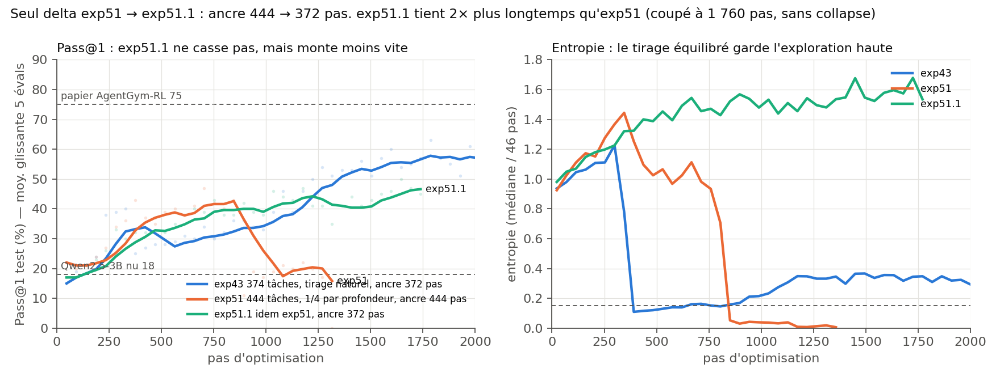

# Bilan final — ce que disent les derniers runs (phase 3, 15/09 → 03/10/2026)

Ce document clôt le projet. Il résume ce que les expériences menées **après le rapport de stage**
(exp41 → exp51.1) permettent de conclure, avec leurs limites. Le détail run par run, les chiffres et
les figures 1 à 6 sont dans [`ANALYSE_runs_post_rapport.md`](ANALYSE_runs_post_rapport.md) ; le
registre complet des runs est [`runs/INDEX.md`](../../runs/INDEX.md).

**Recette commune** (sauf mention) : Qwen2.5-3B-Instruct, LoRA r8/α32, LR 3e-6, β 0.01 (pénalité KL),
bonus d'entropie 0.001, 64 épisodes par mise à jour, 30 tours max, 512 tokens par tour, référence KL
mobile par ReLoRA toutes les 4 époques. Une évaluation = pass@1 sur 100 tâches de test (bruit ±5 pts) :
on lit des moyennes glissantes et des plateaux, pas des pics.

---

## 1. La question de départ de la phase 3

Le rapport concluait que deux choses rendaient l'entraînement stable : une **référence KL mobile**
(re-baser la pénalité KL sur la politique courante toutes les 4 époques) et, à G=16, le **curriculum
d'horizon** (10 → 20 → 30 tours). Trois questions restaient ouvertes :

1. Le curriculum est-il un moteur de performance, ou seulement une protection contre le collapse ?
2. Dans la référence mobile (qui est en fait ReLoRA : fusion de l'adaptateur, adaptateur neuf, Adam
   purgé), quel ingrédient stabilise vraiment ?
3. Pourquoi « toutes les 4 époques », et ce réglage est-il robuste ?

## 2. Réponses

### 2.1 Le curriculum protège, il ne fait pas la performance

- **À G=16**, borner l'estimateur KL à 10 par token (`--kl-clamp 10`, comme le code du papier de
  référence) donne **le même résultat que le curriculum** : 82 en best, plateau 77 contre 79 (exp43
  contre exp32). Sans l'un ni l'autre, le même run s'effondre vers l'époque 10 (exp36).
- **À G=8**, où il n'y a pas de collapse à prévenir, le curriculum n'apporte presque rien (exp44 ≈
  exp25, plateau ~57-60).
- Nuance : le curriculum garde une politique plus exploratoire (entropie plus haute) que la borne.

### 2.2 C'est le reset de l'adaptateur qui stabilise

ReLoRA fait trois choses à chaque ré-ancrage. On les a séparées (G=8, fig. 5) :

| Ce qu'on garde | Run | Ce qui se passe |
|---|---|---|
| tout (ReLoRA) | exp25 | stable 100+ époques, entropie ~1.1, 65 |
| référence mobile seule | exp46 | collapse vers l'époque 9, 0/100 ensuite |
| référence mobile + LR ÷3 | exp48 | même collapse, retardé (époque ~18) |
| référence mobile + purge d'Adam | exp49 | entropie et KL cassent dès l'époque 8, mais le score survit (45 @ ép. 40) avec une politique quasi déterministe et laconique |
| référence fixe + borne KL | exp45 | collapse, entropie → 0 |

**Seule la remise à zéro du produit B·A** (l'adaptateur fusionné dans la base, B repart de 0) garde
une dynamique saine. Déplacer la référence, baisser le LR ou purger Adam ne la remplacent pas. La
borne KL coupe la queue explosive de l'estimateur, pas la dérive de fond.

### 2.3 La dérive suit une horloge en pas : il faut ré-ancrer avant ~370 mises à jour

Sans reset, la KL médiane passe de 1e-3 à ~0.1 en **~370 mises à jour à LR 3e-6, que G vaille 8 ou
16**, puis explose en ~100 mises à jour (fig. 6). À LR 1e-6 le seuil recule à ~780, mais la dérive
reste géométrique (exp47) : c'est cohérent avec une croissance multiplicative du produit B·A.

La période de ré-ancrage étant définie **en époques**, sa valeur **en pas** dépend de G et de la
taille du dataset :

| Run | Pas entre deux ancres | Verdict |
|---|---|---|
| exp25 (G=8) | 184 | stable, marge ×2 |
| exp41 (G=8, /8 ép.) | 374 | stable |
| exp32, exp43 (G=16) | 372 | stable, avec curriculum ou borne |
| exp51 (G=16, 444 tâches) | 444 | collapse à l'époque 8 |
| exp50 (G=16, /10 ép.) | 930 | collapse à l'époque 5, avant la 1re ancre |
| exp36.1 (G=16, /12 ép.) | ~1 100 | collapse à l'époque 5, avant la 1re ancre |

Le « bon » réglage /4 époques avait donc de la marge à G=8, mais **tombait pile sur le seuil à
G=16** : c'était en partie de la chance, et cela explique que G=16 ait besoin d'une protection en plus.

### 2.4 Le dernier run (exp51.1) confirme la règle

exp51 ajoutait 70 recettes au dataset (dont 7 de profondeur 4, la plus dure) et tirait les tâches à
parts égales par profondeur. Il s'est effondré à l'époque 8, mais avec deux changements confondus :
le tirage, et le rythme d'ancre passé à 444 pas (444 tâches au lieu de 374). **exp51.1 ne change que
le rythme d'ancre** (3,35 époques ≈ 372 pas) :

- **il ne s'effondre pas** : KL ~1e-3 sur toute la durée, 4 ré-ancrages, best 50 ; arrêté le 03/10
  vers l'époque 16 (1 760 pas, deux fois le point de rupture d'exp51 ; arrêt sans erreur dans le log,
  cause non identifiée) ;
- **son entropie reste très haute** (~1.5, contre ~0.1-0.3 pour exp43) : tirer 50 % de tâches
  profondes, rarement réussies, maintient l'exploration ;
- **il monte moins vite** qu'exp43 à pas égal (~47 contre ~57 au pas 1 750) : une partie du budget va
  à des tâches qui ne donnent presque pas de signal.

Le collapse d'exp51 venait donc du rythme d'ancre, pas du tirage. En revanche, l'effet du tirage sur
le **mur de profondeur 4** (0 % dans tous les runs du projet) reste inconnu : le run a été coupé trop
tôt et l'évaluation périodique ne détaille pas les scores par profondeur.

## 3. Ce que le projet permet de conclure

GRPO multi-tour en LoRA dérive de façon multiplicative : sans intervention, la politique s'éloigne
géométriquement de sa référence, se déterminise, puis l'estimateur KL explose et détruit les
générations. **ReLoRA est un coupe-circuit** : il remet B·A à zéro avant que la dérive n'atteigne son
seuil (~370 mises à jour dans nos réglages). La borne KL et le curriculum d'horizon donnent une marge
supplémentaire, interchangeable, qui rend G=16 viable et mène à **82 % de pass@1 sur TextCraft avec un
modèle 3B sur un seul GPU, au-dessus des 75 % publiés par AgentGym-RL** sur plusieurs GPU.

Recommandation pratique : **exprimer la période de ré-ancrage en mises à jour (~200), pas en époques**,
pour garder la même marge quel que soit G ou la taille du dataset.

## 4. Limites

- **Un run par configuration.** Chaque verdict repose sur une seule graine ; les écarts de quelques
  points entre configurations ne sont pas significatifs.
- **Mécanisme non démontré.** La dynamique multiplicative de B·A est l'explication la plus cohérente
  avec exp46-49, pas une preuve : il manque une mesure directe (norme de B·A, valeurs singulières).
- **Un seul environnement, un seul modèle.** Les seuils en pas dépendent du LR, de β et du rang LoRA.
- **Profondeur 4 non résolue.** Aucun run n'a dépassé 0 sur les 3 tâches de test de profondeur 4.

## 5. Ce qui n'a pas été lancé

| Expérience | Question | Coût estimé |
|---|---|---|
| β 0.1 avec référence fixe | un frein KL plus fort remplace-t-il ReLoRA, ou plafonne-t-il ? | ~9 h |
| G=8, ancre /10 ép. (~460 pas) | test direct de la règle des ~370 pas à G=8 | ~9 h |
| exp51.1 jusqu'à 80 époques | le tirage équilibré fait-il céder la profondeur 4 ? | ~57 h |
| exp52 (tirage ∝ √n par profondeur) | version douce du rééquilibrage | ~57 h |
| ré-ancrage défini en pas | implémenter `--moving-anchor-every-steps` et revalider exp43 | dev + ~48 h |
| mesure de ‖B·A‖ pendant la dérive | confirmer le mécanisme multiplicatif | analyse hors GPU sur les ancres sauvées |
